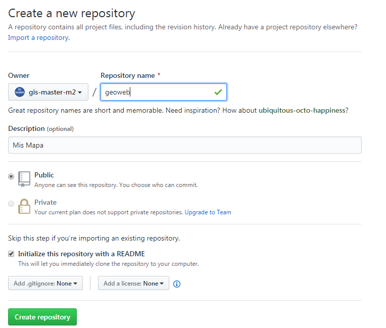

 
       

 
###  Recursos GitHub

* Web
[https://github.com/](https://github.com/)

* Tutorial
[https://guides.github.com/activities/hello-world/](https://guides.github.com/activities/hello-world/)

* Github Pages
[https://guides.github.com/features/pages/](https://guides.github.com/features/pages/)

* Tutorial
[http://rogerdudler.github.io/git-guide/index.es.html](http://rogerdudler.github.io/git-guide/index.es.html)

* Wikipedia
[https://es.wikipedia.org/wiki/GitHub](https://es.wikipedia.org/wiki/GitHub)

    


    
### Descripción 
>GitHub es un reporsitorio de código dónde podremos subir nuestros proyectos y también hosting de una pàgina web.

### Ejemplo crear web site

* Requisitos Instalar cliente GIT para windows [https://git-scm.com/download/win](https://git-scm.com/download/win)
 
#### Paso 1

* Crear usuario en: [https://github.com/](https://github.com/)

#### Paso 2

* Creamos nuevo repo llamado **geoweb**




#### Paso 3
* Crearemos repo des de nuestro pc [Tutorial](https://help.github.com/articles/adding-an-existing-project-to-github-using-the-command-line/)

* Nos situamos dentro del directori **geoweb** de nuestro servidor y abrimos termial git (botón derecho mouse y Git Bash here)

```sh
git init
git add .
git commit -m "proyecto geoweb"
git remote add origin https://github.com/{tu usuario git}/geoweb.git
git remote -v
git push -u origin master

```
Atentificamos con usuario y password  

#### Paso 4

* Verificamos en github.com que se ha subido toda la documentación y creamos arcihivo readme **add Readme**

#### Paso 5

* Vamos a la terminal de git y escribimos

```sh 

git pull
``` 
 
     
#### Paso 6

 * Abrimos archivo readme con editor VSCode y añadimos text descriptivo de nuestro proyecto
 * Guardamos y desde la terminal git

```sh

git add .
git commit -m "change readme"
git push -u origin master

```

!!! note
    Cada vez que editamos debemos hacer esta operación para subir código


#### Paso 7

* Para convertir el repo en una página web, vamos al proyecto en github.com
* Seleccionamos optión Settings
* GitHub Pages  opción **master branch**


#### Para recuperar nuestro trabajo en casa, por ejemplo

```sh
git clone  https://github.com/{tu usuario git}/geoweb.git

```
