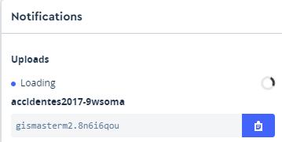

 
       
#### Web
* [https://www.mapbox.com/](https://www.mapbox.com/)

#### Productos
* [https://www.mapbox.com/products/](https://www.mapbox.com/products/)

#### APIs
* [https://www.mapbox.com/api-documentation/](https://www.mapbox.com/api-documentation/)

#### **Página referéncia MapBox GL!!**
* [https://www.mapbox.com/mapbox-gl-js/api/](https://www.mapbox.com/mapbox-gl-js/api/)

#### GitHUB
* [https://github.com/mapbox](https://github.com/mapbox)

#### Tutoriales
* [https://www.mapbox.com/mapbox-gl-js/example/simple-map/](https://www.mapbox.com/mapbox-gl-js/example/simple-map/)
* [https://www.mapbox.com/help/tutorials/](https://www.mapbox.com/help/tutorials/)
* [https://www.mapbox.com/help/studio-manual/](https://www.mapbox.com/help/studio-manual/)
* [https://ovrdc.github.io/gis-tutorials/mapbox/](https://ovrdc.github.io/gis-tutorials/mapbox/)

#### Videos
* [https://www.youtube.com/watch?v=jrnoFU5Wkdo](https://www.youtube.com/watch?v=jrnoFU5Wkdo)
* [https://www.youtube.com/watch?v=Zn3Xx-TSrM8](https://www.youtube.com/watch?v=Zn3Xx-TSrM8)
* [https://www.youtube.com/watch?v=r6Ij_34xTD0](https://www.youtube.com/watch?v=r6Ij_34xTD0)
* [https://www.youtube.com/watch?v=YhynsA9_fPc](https://www.youtube.com/watch?v=YhynsA9_fPc)

  
### Descripción 
> MapxBox es una empresa privada que ofrece una plataforma para la publicacón de mapas. Mapbox destaca por creado de forma abierta

*  MBTiles
*  Vector Tiles
*  MapBox GL

     
###  ¿Cómo empezar?

> Vamos a realizar un ejercicio dóne veremos como funciona MapBox Studio, Vector Tiles y Mapbox GL
> Crearemos un mapa personalizado
> Nos damos de alta en [MapBox](https://www.mapbox.com/signup/)

### 1.Mapa personalizado

#### Creamos nuestor propio estilo

* Entramos en MapBox.com `Studio` --`Styles` -- `New style`

* Seleccionamos un estilo como base y cambiamos colores `Publish your style`

* Share, develop, and use your style -- Copiamos `Style URL` y `Access token`  


#### Visualizar estilo propio con Mapbox gl

Creamos **Mapbox-estilo.html**


```html
 <html>
<head>
    <meta charset='utf-8' />
    <title>Mapbox estilo</title>
    <meta name='viewport' content='initial-scale=1,maximum-scale=1,user-scalable=no' />
    <script src='https://api.tiles.mapbox.com/mapbox-gl-js/v0.52.0/mapbox-gl.js'></script>
    <link href='https://api.tiles.mapbox.com/mapbox-gl-js/v0.52.0/mapbox-gl.css' rel='stylesheet' />
    <style>
        body {
            margin: 0;
            padding: 0;
        }

        #map {
            position: absolute;
            top: 0;
            bottom: 0;
            width: 100%;
            height: 100%
        }
    </style>
    <script>
        //Añadir vuestor token y vuestro estilo
        function init() {
            mapboxgl.accessToken =
                'pk.eyJ1IjoiZ2lzbWFzdGVybTIiLCJhIjoiY2plZHhubTQxMTNoYzMza3Rqa3kxYTdrOCJ9.53B1E6mKD_EQOVb2Y0-SsA';
            var map = new mapboxgl.Map({
                container: 'map',
                style: 'mapbox://styles/gismasterm2/cjqg9p2lm00442rqm4vlk89rt',
                center: [2.16859, 41.3954],
                zoom: 13,
                attributionControl: false
                });
            map.addControl(new mapboxgl.AttributionControl({compact: true}));
            map.addControl(new mapboxgl.NavigationControl());
        }
    </script>
</head>

<body onload="init()">
    <div id="map"></div>
</body>

</html>    

```
### 2.Crear un Tileset o capa de datos própios


#### Paso 1

* Descargamos en formato **CSV** los [accidentes](datos/accidentes2017.geojson) en [http://opendata-ajuntament.barcelona.cat/data/es/dataset/accidents-tipus-gu-bcn">
    http://opendata-ajuntament.barcelona.cat/data/es/dataset/accidents-tipus-gu-bcn)
  

* Utilizamos QGIS para visualizar y convertir a formato GeoJSON en EPSG:4326 --accidentes2017.geojson

     
#### Paso 2 -Añadimos accidentes2017.geojson a Mapbox.com 

* Entramos en MapBox.com `Studio`  `Tilesets` `New tileset` Arrastramos **accidentes2017.geojson**

* Copiamos nuestro Mapa Id

* `Share, develop, and use your style` -- Copiamos `Style URL` y `Access token`



#### Visualizar nuestor propio Tileset

Creamos **Mapbox-accidentes.html** Ejemplo Accidentes Barcelona 

```html
   <html>

<head>
    <meta charset='utf-8' />
    <title>Accidentes BCN</title>
    <meta name='viewport' content='initial-scale=1,maximum-scale=1,user-scalable=no' />
    <script src='https://api.tiles.mapbox.com/mapbox-gl-js/v0.52.0/mapbox-gl.js'></script>
    <link href='https://api.tiles.mapbox.com/mapbox-gl-js/v0.52.0/mapbox-gl.css' rel='stylesheet' />
   
    <style>
        body {
            margin: 0;
            padding: 0;
        }

        #map {
            position: absolute;
            top: 0;
            bottom: 0;
            width: 100%;
            height: 100%
        }

        .legend {
            background-color: #fff;
            border-radius: 3px;
            bottom: 30px;
            box-shadow: 0 1px 2px rgba(0, 0, 0, 0.1);
            font: 12px/20px 'Helvetica Neue', Arial, Helvetica, sans-serif;
            padding: 10px;
            position: absolute;
            right: 10px;
            z-index: 1;
        }

        .legend h4 {
            margin: 0 0 10px;
        }

        .legend p {
            margin-left: 30px;
            position: absolute;
            display: block;
            top: 0;
        }

        .legend div {
            position: relative;
        }

        .legend div span {
            border-radius: 50%;
            display: inline-block;
            margin-right: 5px;
            opacity: 0.8;
            background-color: #d49a66;
        }

        .map-overlay {
            font: 12px/20px 'Helvetica Neue', Arial, Helvetica, sans-serif;
            position: absolute;
            width: 25%;
            top: 0;
            left: 0;
            padding: 10px;
            z-index: 100;
        }

        .map-overlay .map-overlay-inner {
            background-color: #fff;
            box-shadow: 0 1px 2px rgba(0, 0, 0, 0.20);
            border-radius: 3px;
            padding: 10px;
            margin-bottom: 10px;
        }

        .map-overlay input {
            background-color: transparent;
            display: inline-block;
            width: 100%;
            position: relative;
            margin: 0;
            cursor: ew-resize;
        }
    </style>

    <script>
        function Init() {
            /* Paso 0
            var diasSemana = ["Dilluns", "Dimarts", "Dimecres", "Dijous", "Divendres", "Dissabte", "Diumenge"];
            var colorDia = ['#e26131', '#d0d378', '#78d3b0', '#78bcd3', '#9e78d3', '#d378cd', '#d37878'];
            */
           mapboxgl.accessToken =
                    'pk.eyJ1IjoiZ2lzbWFzdGVybTIiLCJhIjoiY2plZHhubTQxMTNoYzMza3Rqa3kxYTdrOCJ9.53B1E6mKD_EQOVb2Y0-SsA';
                var map = new mapboxgl.Map({
                    container: 'map',
                    style: 'mapbox://styles/gismasterm2/cjqg9p2lm00442rqm4vlk89rt',
                    center: [2.16859, 41.3954],
                    zoom: 13,
                    hash: true,
                    pitch: 45,
                    attributionControl: false
                });
            map.addControl(new mapboxgl.AttributionControl({compact: true}));
            map.addControl(new mapboxgl.NavigationControl());
            /* Paso 1
            creaLeyenda();
            */           
            map.on('load', function () {
                map.addSource("accidentes_source", {
                    type: "vector",
                    url: "mapbox://gismasterm2.8n6i6qou"
                }); //fin map source

                map.addLayer({
                    id: "accidentes",
                    type: "circle",
                    source: "accidentes_source",
                    'source-layer': "accidentes2017-9wsoma",
                    /* pas0 1
          paint: {
      'circle-radius': 4,
      'circle-color': {
        property: "Descripcio_dia_setmana",
        type: 'categorical',
        stops: [
        [diasSemana[0], colorDia[0]],
        [diasSemana[1], colorDia[1]],
        [diasSemana[2], colorDia[2]],
        [diasSemana[3], colorDia[3]],
        [diasSemana[4], colorDia[4]],
        [diasSemana[5], colorDia[5]],
        [diasSemana[6], colorDia[6]]
        ]
      },
      'circle-opacity': 0.8
    }
    */
                    /* Paso 2
                    ,filter:['==', 'Descripcio_dia_setmana', diasSemana[0]]
                    */

                }); //fin add layers


                /* Paso 2

                document.getElementById('slider').addEventListener('input', function(e) {
                    filtraDias(e.target.value);           
                    });
                
                */


            }); //Fin load mapa

            /* Paso 1
            function creaLeyenda() {
                var leyendaHtml = "<div>Semana</div>";
                for (i = 0; i < diasSemana.length; i++) {
                    leyendaHtml = leyendaHtml + '<div><span style="background-color:' + colorDia[i] +
                        ';width:10px;height:10px;margin: 0 5px"></span>' + diasSemana[i] + '</div>';

                }

                document.getElementById('legend').innerHTML = leyendaHtml;
            }
            */
            /* Paso 2
            function filtraDias(numdia){
                  var filters = ['==', 'Descripcio_dia_setmana', diasSemana[numdia]];
                  map.setFilter('accidentes', filters);
                  document.getElementById('diasemanaid').textContent = diasSemana[numdia];
            }
            */

        }
    </script>
</head>

<body onload="Init()">
 <!-- Paso 1
    <div id='legend' class='legend'>
        ### Accidentes
    </div>
 -->

    <!-- Pas 2
      <div class='map-overlay top'>
          <div class='map-overlay-inner'>
      ### Accidentes x dias de la semana
    <label id='diasemanaid'></label>
    <input id='slider' type='range' min='0' max='6' step='1' value='0' />
          </div>
      </div>
    -->
    <div id='map'></div>

</body>

</html>

``` 
!!! note
    **Probamos**:Añadir opción para ver todos los accidentes

### 3.Añadir estilos (ICGC) y capas externas (GeoJSON)

>Podemos trabajar con la libreria JS de Mapbox sin utilizar sus estilos , servicios ni app Tokens

#### OpenICGC

> Presenta estilos y bases Vector Tiles mundiales dónde fusiona datos OSM y del ICGC en un esquema de OpenMapTiles

>[https://openicgc.github.io/](https://openicgc.github.io/)


#### Mapa de carriles bici con estilo Hibrid

* Seleccionaremos el estilo Hibrid de OpenICGC
* Copiaremos el archivo [carriles bici](datos/carrils-bici.geojson) dentro de **geoweb**
* Creamos archivo **mapbox-icgc.html**

```html
<html>
<head>
    <meta charset='utf-8' />
    <title>Carriles bici BCN</title>
    <meta name='viewport' content='initial-scale=1,maximum-scale=1,user-scalable=no' />
    <script src='https://api.tiles.mapbox.com/mapbox-gl-js/v0.52.0/mapbox-gl.js'></script>
    <link href='https://api.tiles.mapbox.com/mapbox-gl-js/v0.52.0/mapbox-gl.css' rel='stylesheet' />
    <style>
        body {
            margin: 0;
            padding: 0;
        }
        #map {
            position: absolute;
            top: 0;
            bottom: 0;
            width: 100%;
            height: 100%
        }
    </style>
    <script>
        function Init() {

            mapboxgl.accessToken = '';
            var map = new mapboxgl.Map({
                container: 'map',
                style: 'https://geoserveis.icgc.cat/contextmaps/hibrid.json',
                center: [2.16859, 41.3954],
                zoom: 13,
                hash: true,
                pitch: 45,
                attributionControl: false
            });
            map.addControl(new mapboxgl.AttributionControl({
                compact: true
            }));
            map.addControl(new mapboxgl.NavigationControl());

            map.on('load', function () {
                map.addSource("carrils-bici", {
                    type: "geojson",
                    data: "datos/carrils-bici.geojson"
                }); //fin map source

                map.addLayer({
                    id: "carrils-bici-layer",
                    type: "line",
                    source: "carrils-bici",
                    layout: {
                        "line-join": "round",
                        "line-cap": "round"
                    },
                    paint: {
                        "line-color": "#FF0000",
                        "line-width": 8
                    }
                }); //fin add layers
            }); //Fin load mapa
        }
    </script>
</head>
<body onload="Init()">
    <div id='map'></div>
</body>
</html>
```

!!! note
    **Probamos**:Cambiar color carriles y estilo de fondo

!!! warning
    ### Práctica Cementrio. **Puntuable!!**

    * Creamos nuevo estilo en Mapbox.com

    * Cargamos capas [datos/constru_cementerio.geojson](datos/constru_cementerio.geojson) y [datos/cementerio.geojson](datos/cementerio.geojson)

    * Añadimos como tileset en MapxBox

    * Integramos el tileset dentro nuestro estilo creado `Menu`  `Add Tileset to Style`

    * Editamos capas

    * Creamos visor ejemplo **mapbox-cementerio.html**


### Extra: Visualizar estilo Mapbox en Leaflet

```html
  <html lang="es">

<head>
    <title>Leaflet y Mapox</title>
    <meta charset="utf-8" />
    <meta name="viewport" content="width=device-width, initial-scale=1.0">
    <meta name="author" content="autor" />
    <meta name="description" content="descripción página">
    <meta name="robots" content="index,follow">
    <link rel="stylesheet" href="https://cdnjs.cloudflare.com/ajax/libs/leaflet/1.3.0/leaflet.css" />
    <script src="https://cdnjs.cloudflare.com/ajax/libs/leaflet/1.3.0/leaflet.js"></script>
    <style>
        body {
            margin: 0;
            padding: 0;
            overflow: hidden;
        }

        #map {
            height: 100%;
            width: 100%;
        }
    </style>
    <script>
        var map;
        var capa1;

        function init() {
            map = L.map('map', {
                center: [41.6863, 1.8382],
                zoom: 8,
                attributionControl: false
            });
            // subtituir por vuestra layer
            capa1 = L.tileLayer(
                'https://api.mapbox.com/styles/v1/gismasterm2/cjcumodeg0i4p2rpaihqxx96w/tiles/256/{z}/{x}/{y}?access_token=pk.eyJ1IjoiZ2lzbWFzdGVybTIiLCJhIjoiY2plZHhubTQxMTNoYzMza3Rqa3kxYTdrOCJ9.53B1E6mKD_EQOVb2Y0-SsA', {
                    maxZoom: 19,
                    minZoom: 1,
                    attribution: 'Mapbox'
                });
            capa1.addTo(map);

        }
    </script>
</head>

<body onload="init()">
    <div id="map"></div>
</body>

</html>

```
